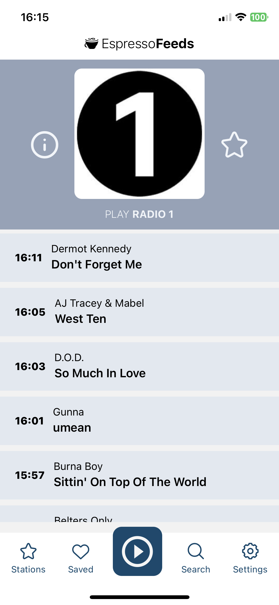

# Espresso Feeds App [iOS/Android]

   

   

Espresso Feeds was my first mobile app and it was developed in React Native. It's a radio app where a user can save favourite stations, save tracks from the station playlist, search radio stations and a settings page. The station page shows the most recent 10 tracks played. The navbar holds menu icons and player icon.

<!--  -->

## Dev Log
  - [x] Nest Screen stack inside Tab stack
  - [x] ~~Heart icon to save track~~ Swipe Gestures
  - [ ] Double-Tap gesture for 'save'?
  - [x] Pass route props to search results
  - [x] Manage storage with arrays
  - [x] Complete storage keys
  - [x] Manage stations from storage
  - [ ] Navigation headers
  - [ ] Manually add station
  - [ ] Display current station/track playing somewhere like a status bar
  - [ ] Settings: Custom values & switches
  - [ ] Sharing features

__BUGS__
  - [x] No refresh on screen focus
  - [ ] Stations.jsx refreshes on focus, need alternative
  - [ ] Error: Prevent duplicates
  - [x] Star: enabled/static?
  - [x] Error: seeking interrupted
  - [ ] Search clears on play (from Station.jsx)

## Support Me

